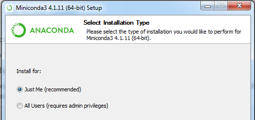
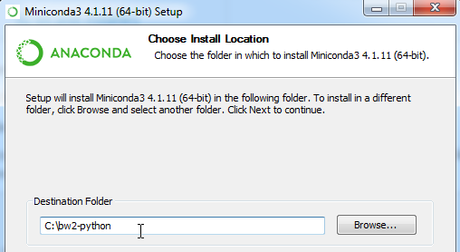
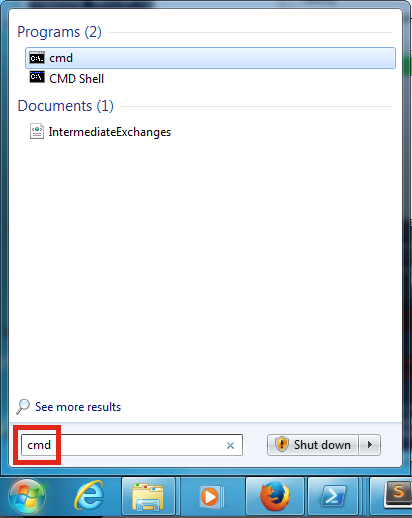
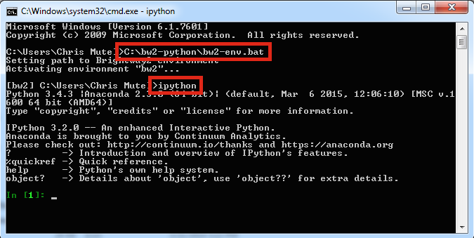
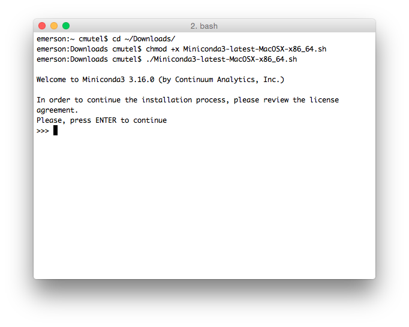
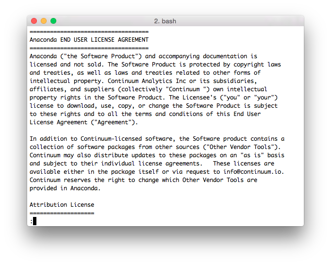
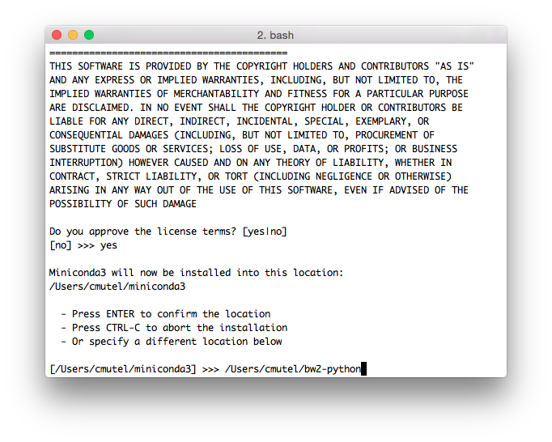
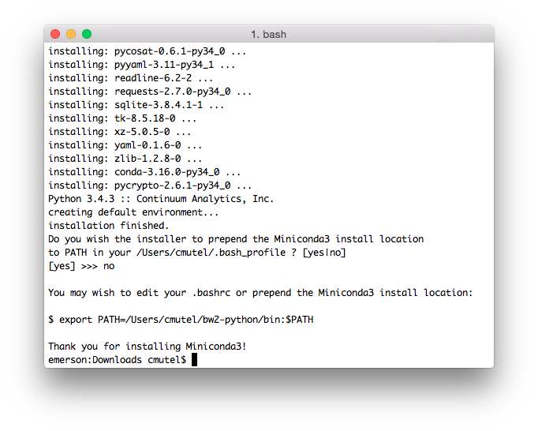

Installation
````````````

.. _installation:

Installation
************

Brightway can be installed pretty much everywhere, on Windows, OS X, Linux, and anywhere else Python can be compiled.

.. note:: Brightway is under heavy development, and relies a continuous integration pipeline to build development versions of the libraries. This means that when installing with ``pip``, one needs ``pip --pre``; when installing with ``conda``, many packages are ``x-dev`` instead of ``x``. Moreover, as we rely on a continuous integration pipeline to build development packages, and any single one of these services may be down on a given day, the pipeline might be broken when you try to install Brightway.

.. note:: All of Brightway can be installed with ``pip``, but the fast linear algebra solvers are **much easier** to install with ``conda``.

.. warning:: Not all packaging is up yet, so installation no worky right now. This notice will be removed when I have time to fix x, y, and z.

If you have ``conda`` installed already, just run:

    conda install -c conda-forge -c cmutel -c cmutel/label/nightly -c haasad bw_calc bw_default_backend

Installing Conda
================

1. Install `Miniconda version 3.7 64-bit <https://docs.conda.io/en/latest/miniconda.html>`__ (See :ref:`anaconda` for detailed help).

2. Update conda

.. code-block:: bash

    conda update conda

3. In a terminal window or command line shell, create a new `conda environment <https://docs.conda.io/projects/conda/en/latest/user-guide/tasks/manage-environments.html>`__. A conda environment is like a separate computer where software packages don't conflict with each other. You can call it whatever your want:

.. code-block:: bash

    conda create -n bw_new python=3.7

You can change ``bw_new`` to another name if you want.

4. Activate your environment, using one of the following (depending on your OS):

.. code-block:: bash

    source activate bw_new
    activate bw_new

5. Install Brightway:

.. code-block:: bash

    conda install -y -c conda-forge -c cmutel -c cmutel/label/nightly -c haasad bw_calc bw_default_backend jupyter

6. If you are on Windows, you also need to do:

.. code-block:: bash

    conda install -y -c conda-forge pywin32

7. After installing all packages, you can save some disk space by cleaning conda:

.. code-block:: bash

    conda clean -tipsy

.. _anaconda:

Running the Miniconda installer
===============================

Windows
-------

Double click the installer file ``Miniconda3-latest-Windows-x86_64.exe``.

Install just for yourself:



Next, change the default installation location to somewhere easy to type, like in your home directory or ``C:\miniconda\``:



Unless you have other Python versions installed, it is fine to make this your default Python.

Launching and using a command shell
-----------------------------------

You can also manually launch Python in a command shell using the application launcher. The launch procedure varies depending on the version of Windows you are running, but is usually next to the main Windows home button. Typing ``cmd`` should be enough to find the program you are looking for:



.. note:: You can usually use the right mouse button to paste into command shell or PowerShell windows.

You can copy and paste, or simply type commands, into the command shell. You will need to activate the environment in each terminal window.



In the command shell, you can enter the ipython interpreter with ``ipython``, or run notebooks with ``jupyter notebook``. Note that you can't launch the notebook server from the root ``C:\`` drive, you must be in a directory, e.g. ``C:\my-notebooks\``.

OS X/Linux
----------

.. note:: On Mac OS X, you might have to make the bash script executable: ``chmod +x ~/Downloads/Miniconda3-latest-MacOSX-x86_64.sh``

Run ``Miniconda3-latest-MacOSX-x86_64.sh`` (or equivalent) to start the Miniconda installer:



Press enter to start reading the Miniconda license.



Press the space bar to go through the license.



Type ``yes`` to agree to the license terms. Next, change the default installation location to something easy to find and remember, like ``/Users/<your user name>/miniconda/`` (OS X) or ``/home/<your user name>/miniconda/`` (Linux).

.. warning:: You can't easily move this directory later, as its path is hard-coded in many files. If you make a mistake, it is better to start the installation from the beginning.

If you don't have another copy of Python on your machine, then you can make this your default Python interpreter. However, it will also work just fine if you don't make it your default Python - you will just need to type a bit more to activate this Python version each time you start a terminal or command shell. If you don't want to make it your default python, then you will need to adjust the paths so that the following commands work. For example, instead of running ``conda``, you will probably need to change to the correct directory first, e.g. something like ``cd ~/miniconda/bin/``.



.. _notebook-directory:

Notebook directory
==================

It is best practice to store your notebooks in separate directories for each project you are working on. One reasonable place would be in your ``Documents`` or ``Desktop``.
